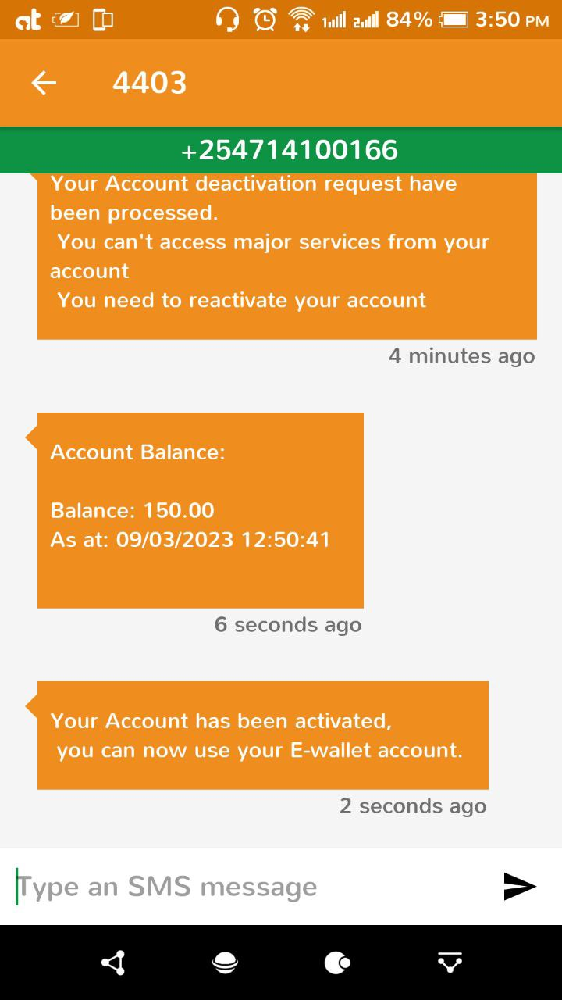

# E-Wallet

This is a simple E-Wallet application that can be accessed via USSD interface. The application allows users to create an account, top up their wallet, make withdrawals, and request for balance and statements. The main notification channel for the application is via SMS.

## Table of Contents

- [Technologies](#technologies)
- [Features](#features)
  - [Account Creation](#account-creation)
  - [Topup](#top-up)
  - [Withdraw](#withdraw)
  - [Balance Check](#check-balance)
  - [Statement Request](#request-statement)
  - [Account Activation](#reactivate-account)
  - [Account Deactivation](#deactivate-account)
- [Installation](#installation)
  - [Clone The Application](#clone-the-application)
  - [Install App Dependencies](#install-app-dependencies)
  - [Run The application](#run-app)
- [Testing](#testing)
- [Deployment](#deployment)
- [Application-Design](#application-design)
  - [Database Design](#database-design)
  - [User Registration Sequence](#user-registration-sequence)
  - [Account Activation Sequence](#account-activation-sequence)
  - [Account Deactivation Sequence](#account-deactivation-sequence)
  - [Account Topup Sequence](#account-topup-sequence)
  - [Account withdraw Sequence](#account-withdraw-sequence)
  - [Account Balance Request Sequence](#account-balance-request-sequence)
  - [Account Statement Request Sequence](#account-statement-request-sequence)
  - [User Initiated C2B Topup Sequence](#user-initiated-c2b-topup-sequence)
- [License](#license)

## Technologies

The application is built using the following technologies:

- Python: Programming language used to build the application
- Flask: Web framework used to create the USSD application
- Sqlite: Relational database used to store user information and transaction details
- Redis: Used for efficient scheduling of tasks
- Africa's Talking API: Used for payment handling and SMS notifications to users

## Features

The application offers the following features:

- Account Creation: Users can create an account by entering their name and phone number.
- Top Up: Users can top up their wallet by entering the amount they wish to add.
- Withdraw: Users can withdraw money from their wallet by entering the amount they wish to withdraw.
- Check Balance: Users can check their wallet balance by selecting the balance option from the menu.
- Request Statement: Users can request for their transaction statement by selecting the statement option from the menu.

## Installation

To install and run the application, follow these steps:

### Clone-The-Application
Clone the repository to your local machine.

```bash 
  git clone https://github.com/Gibson-Gichuru/E-wallet
```

### Install-App-Dependencies

The application requires redis to be installed and running.
Redis can be installed by following the instructions
[here](), also you need to have Poetry dependency manager installed  
use the [steps](https://python-poetry.org/docs/) to install Poetry.  

Once redis and Poetry are installed, navigate to the application root directory and run the command below.  
```bash
 poetry install
```

Create a .env file and update the appropriate as described in the env.txt file  

To install pre-commit and pre-push scripts run.  
```bash

  # make sure the hook script have the appropriate permissions

  sudo chmod +x hooks.py

  # install the hooks

  ./hooks.py -i

  # to uninstall the hooks 
  ./hooks.py -u
```

### Run-App

To run the application simply run

```bash
  poetry run flask run

  # or you can activate the virtual environment then run the application

  poetry shell

  flask run

```

To work with africastalking api you'll need to tunnell the application
so that the callback endpoints can be reached remotely  

The application offers a custom commmand to tunnel the http address it's running on using `ngrock`. To activate tunnelling launch a new terminal session and run

```bash

  # the command should install ngrock
  poerty run flask tunnel

  # or

  poetry shell

  flask tunnel
```

The tunnell command will update the application .env file to include full url routes to all the callbacks used in the application

## Testing

The application was developed using a test-driven approach, and tests are included in the `tests` folder. To run the tests, execute `poetry run flask test` from the command line.

## Deployment

The application is deployed to an AWS EC2 instance using a CI/CD pipeline with GitHub Actions. The pipeline automatically tests and deploys the application whenever code is pushed to the `main` branch. The configuration for the pipeline can be found in the `.github/workflows/deploy.yml` file.

The application offers a custom script To install the application on a server. 

To deploy the application nginx (other web servers can be used) should be installed. to install the application simply run.

```bash
  sudo chmod +x Setup.py

  ./Setup.py
```

The command installs the application as a systemd service and enabling it to launch on boot. (the assumption is that the application would be installed on a unix based operating system which uses `systemd`)

The script also updates the database schema to feature the latest schema (any sqlbased database server can be used. By default the application uses `sqlite` as the main database )

Also the script builds nginx config file and installs it.

Nginx is used as a reverse proxy in this case, thus if any other webserver is used make 
sure it supports reverse proxying to a socket file. as the application on a production 
environment interfaces with the reverse proxy via a unix socket file

## How It Works

### Account-Creation

When a user dials the USSD code, they are prompted to create an account by entering their username.

<div style="display:flex; gap:2rem; flex-wrap:wrap;">
  
  
  

</div>

### Top-Up

Users can top up their wallet by entering the amount they wish to add.

<div style="display:flex; gap:2rem; flex-wrap:wrap;">
  
  
  
    

</div>

### Withdraw

Users can withdraw money from their wallet by entering the amount they wish to withdraw.

<div style="display:flex; gap:2rem; flex-wrap:wrap;">
  
  
  
</div>

### Check-Balance

Users can check their wallet balance by selecting the balance option from the menu.

<div style="display:flex; gap:2rem; flex-wrap:wrap;">
  
  
  
</div>

### Request-Statement

Users can request for their transaction statement by selecting the statement option from the menu.
<div style="display:flex; gap:2rem; flex-wrap:wrap;">
  
  
</div>

### Reactivate-Account

Users can request for account reactivation
<div style="display:flex; gap:2rem; flex-wrap:wrap;">
  
  
  
</div>

### Deactivate-Account

Users can request for account deactivation at will
<div style="display:flex; gap:2rem; flex-wrap:wrap;">
  
  
  
</div>

## Application-Design

### Database-Design
<!--  -->


### User-Registration-Sequence
<!--  -->


### Account-Activation-Sequence
<!--  -->


### Account-Deactivation-Sequence
<!--  -->


### Account-Topup-Sequence
<!--  -->


### Account-withdraw-Sequence
<!--  -->


### Account-Balance-Request-Sequence
<!--  -->


### Account-Statement-Request-Sequence
<!--  -->


### User-Initiated-C2B-Topup-Sequence
<!--  -->


## License

This project is licensed under the MIT License. See the [LICENSE](LICENSE) file for details.
